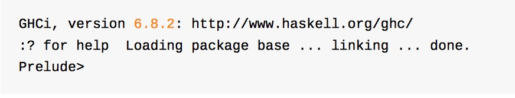

### Haskell

#### 下载
>  apt-get install Haskell-platform  

#### 运行
>  命令行种输入 ghci
>  

#### 命令
>  运算  

    ghci> 2 + 15

    17

    ghci> 49 * 100

    4900

    ghci> 1892 - 1472

    420

    ghci> 5 / 2

    2.5

>  boolean  

    ghci> True && False

    False

    ghci> True && True

    True

    ghci> False || True

    True

    ghci> not False

    True

    ghci> not (True && True)

    False

>  相等性  

    ghci> 5 == 5

    True

    ghci> 1 == 0

    False

    ghci> 5 /= 5

    False

    ghci> 5 /= 4

    True

    ghci> "hello" == "hello"

    True

    succ 8

    9

    ghci> min 9 10

    9

    ghci> min 3.4 3.2

    3.2

    ghci> max 100 101

    101  

>  函数调用拥有最高的优先级  

    ghci> succ 9 + max 5 4 + 1

    16

    ghci> (succ 9) + (max 5 4) + 1

    16

#### 装载函数  

>  :l filename.hs  

---------------------------

#### List  

` List 是最常用的数据结构. List 是一种单类型的数据结构， 可以用来存储多个类型相同的元素。我们可以在里面装一组数字或者一组字符，但不能把字符和数字装在一起。`

>  **Note**: 在 ghci 下，我们可以使用 \`\`let\`\` 关键字来定义一个常量。在 ghci   下运行 > \`\`let a=1\`\` 与在脚本中编写 \`\`a=1\`\` 是等价的。

    ghci> let lostNumbers = [4,8,15,16,23,48]

    ghci> lostNumbers

    [4,8,15,16,23,48]  

>  将两个 List 合并是很常见的操作，这可以通过 现。++ 运算符实

    ghci> [1,2,3,4] ++ [9,10,11,12]

    [1,2,3,4,9,10,11,12]

    ghci> "hello" ++ " " ++ "world"

    "hello world"

    ghci> ['w','o'] ++ ['o','t']

    "woot"

>  在使用 ++ 运算符处理长字符串时要格外小心(对长 List 也是同样)，Haskell 会遍历整个的 List( ++ 符号左边的那个)。在处 理较短的字符串时问题还不大，但要是在一个 5000 万长度的 List 上追加元素，那可得运行好一会儿了。所以说，用 : 运 算符往一个 List 前端插入元素会是更好的选择。

    ghci> 'A':" SMALL CAT"

    "A SMALL CAT"

    ghci> 5:[1,2,3,4,5]

    [5,1,2,3,4,5]  

>  若是要按照索引取得 List 中的元素，可以使用!!运算符，索引的下标为 0。  

    ghci> "Steve Buscemi" !! 6

    'B'

    ghci> [9.4,33.2,96.2,11.2,23.25] !! 1

    33.2  

` 但你若是试图在一个只含有 4 个元素的 List 中取它的第 6 个元素，就会报错。要小心！`  

>  List 同样也可以用来装 List，甚至是 List 的 List 的 List：

    ghci> let b = [[1,2,3,4],[5,3,3,3],[1,2,2,3,4],[1,2,3]]

    ghci> b

    [[1,2,3,4],[5,3,3,3],[1,2,2,3,4],[1,2,3]]

    ghci> b ++ [[1,1,1,1]]

    [[1,2,3,4],[5,3,3,3],[1,2,2,3,4],[1,2,3],[1,1,1,1]]

    ghci> [6,6,6]:b

    [[6,6,6],[1,2,3,4],[5,3,3,3],[1,2,2,3,4],[1,2,3]]

    ghci> b !! 2

    [1,2,2,3,4]  
 
>  List 中的 List 可以是不同长度，但必须得是相同的类型。如不可以在 List 中混合放置字符和数组相同，混合放置数值和字符 的 List 也是同样不可以的。当 List 内装有可比较的元素时，使用 > 和 >= 可以比较 List 的大小。它会先比较第一个元素， 若它们的值相等，则比较下一个，以此类推。

    ghci> [3,2,1] > [2,1,0]

    True

    ghci> [3,2,1] > [2,10,100]

    True

    ghci> [3,4,2] > [3,4]

    True

    ghci> [3,4,2] > [2,4]

    True

    ghci> [3,4,2] == [3,4,2]

    True  

>  **head** 返回一个 List 的头部，也就是 List 的首个元素。

    ghci> head [5,4,3,2,1]

    5

>  **tail** 返回一个 List 的尾部，也就是 List 除去头部之后的部分。

    ghci> tail [5,4,3,2,1]

    [4,3,2,1]  

>  **last** 返回一个 List 的最后一个元素。

    ghci> last [5,4,3,2,1]

    1

>  **init** 返回一个 List 除去最后一个元素的部分。

    ghci> init [5,4,3,2,1]

    [5,4,3,2]  

` 空list 没有上面那些方法，如果调用会报错`

>  **length** 返回一个 List 的长度。

    ghci> length [5,4,3,2,1]

    5  

>  **null** 检查一个 List 是否为空。如果是，则返回 True，否为空，否则返回False。应当避免使用xs==[]之类的语句来判断 List 是否为空。使用 null 会更好。  

    ghci> null [1,2,3]

    False

    ghci> null []

    True  

>  **reverse** 将一个 List 反转:  

    ghci> reverse [5,4,3,2,1]

    [1,2,3,4,5]

>  **take** 返回一个 List 的前几个元素：

    ghci> take 3 [5,4,3,2,1]

    [5,4,3]

    ghci> take 1 [3,9,3]

    [3]

    ghci> take 5 [1,2]

    [1,2]

    ghci> take 0 [6,6,6]

    []  

` 若是图取超过 List 长度的元素个数，只能得到原 List。若 take 0 个元素，则会得到一个空 List！drop 与 take 的用法大体相同，它会删除一个 List 中的前几个元素。`

    ghci> drop 3 [8,4,2,1,5,6]

    [1,5,6]

    ghci> drop 0 [1,2,3,4]

    [1,2,3,4]

    ghci> drop 100 [1,2,3,4]

    []

    Prelude> let b = [[1,2,3],[4,5]]

    [[1,2,3],[4,5]]

    Prelude> let c = drop 1 b

    Prelude> c

    [[4,5]]

    Prelude> b

    [[1,2,3],[4,5]]  

>  **maximum** 返回一个 List 中最大的那个元素。**minimun**返回最小的。

    ghci> minimum [8,4,2,1,5,6]

    1

    ghci> maximum [1,9,2,3,4]

    9  

>  **sum** 返回一个 List 中所有元素的和。**product**返回一个 List 中所有元素的积。

    ghci> sum [5,2,1,6,3,2,5,7]

    31

    ghci> product [6,2,1,2]

    24

    ghci> product [1,2,5,6,7,9,2,0]

    0

>  **elem** 判断一个元素是否在包含于一个 List，通常以中缀函数的形式调用它。

    ghci> 4 `elem` [3,4,5,6]

    True

    ghci> 10 `elem` [3,4,5,6]

    False

#### Range

>  **Range** 是构造 List 方法之一，而 其中的值必须是可枚举的，像 1、2、3、4...字符同样也可以枚举，字母表就是 A..Z 所有字符的枚举。

    ghci> [1..20]

    [1,2,3,4,5,6,7,8,9,10,11,12,13,14,15,16,17,18,19,20]

    ghci> ['a'..'z']

    "abcdefghijklmnopqrstuvwxyz"

    ghci> ['K'..'Z']

    "KLMNOPQRSTUVWXYZ"  

> **Range** 枚举指定规律的字符

    ghci> [2,4..20]

    [2,4,6,8,10,12,14,16,18,20]

    ghci> [3,6..20]

    [3,6,9,12,15,18]  

` tip: 避免在 Range 中使用浮点数。`

    ghci> [0.1, 0.3 .. 1]

    [0.1,0.3,0.5,0.7,0.8999999999999999,1.0999999999999999]  

>>  由于 Haskell 是惰性的，它不会对无限长度的 List 求值，它会等着，看你会从它那儿取多少。  

    ghci> take 10 [3,6..]

` ！！！！！！ don‘t try [3,6..]   ！！！！！！！！`

>  List 的函数 cycle 接受一个 List 做参数并返回一个无限 List 。

    ghci> take 10 (cycle [1,2,3])

    [1,2,3,1,2,3,1,2,3,1]

    ghci> take 12 (cycle "LOL ")

    "LOL LOL LOL "  

