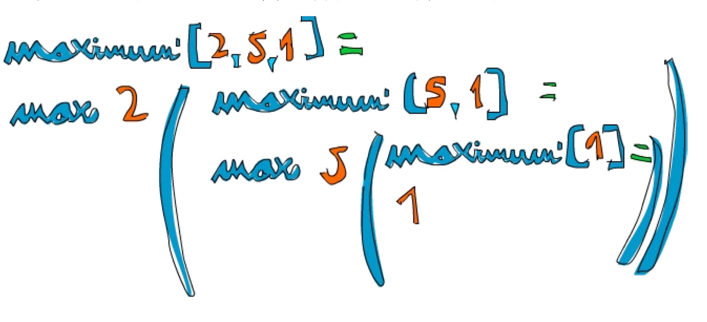

### Haskell
>  Haskell（发音为/ˈhæskəl/）是一种标准化的，通用的纯函数程式语言，有非限定性语义和强静态类型。它的命名源自美国逻辑学家哈斯凯尔·加里，他在数理逻辑方面上的工作使得函数式编程语言有了广泛的基础。在Haskell中，“函数是第一类物件”。作为一门函数程式语言，主要控制结构是函数。Haskell语言是1990年在编程语言Miranda的基础上标准化的，并且以λ演算为基础发展而来。这也是为什么Haskell语言以希腊字母“λ”（Lambda）作为自己的标志。Haskell具有“证明即程序、命题为类型”的特征。 (引用自维基)

--------------

>  在纯种的函数式编程语言中，数据是不可变的，或者说没有变量这个概念，所有的数据一旦产生，就不能改变其中的值，如果要改变，那就只能生成一个新的数据。

--------------

>  这里粗略学习下haskell，主要为了理解下函数式编程思想。

#### 下载
>  apt-get install Haskell-platform  

#### 运行
>  命令行种输入 ghci
>  

#### 命令
>  运算  

    ghci> 2 + 15

    17

    ghci> 49 * 100

    4900

    ghci> 1892 - 1472

    420

    ghci> 5 / 2

    2.5

>  boolean  

    ghci> True && False

    False

    ghci> True && True

    True

    ghci> False || True

    True

    ghci> not False

    True

    ghci> not (True && True)

    False

>  相等性  

    ghci> 5 == 5

    True

    ghci> 1 == 0

    False

    ghci> 5 /= 5

    False

    ghci> 5 /= 4

    True

    ghci> "hello" == "hello"

    True

    succ 8

    9

    ghci> min 9 10

    9

    ghci> min 3.4 3.2

    3.2

    ghci> max 100 101

    101  

>  函数调用拥有最高的优先级  

    ghci> succ 9 + max 5 4 + 1

    16

    ghci> (succ 9) + (max 5 4) + 1

    16

#### 装载函数  

>  :l filename.hs  

---------------------------

#### List  

` List 是最常用的数据结构. List 是一种单类型的数据结构， 可以用来存储多个类型相同的元素。我们可以在里面装一组数字或者一组字符，但不能把字符和数字装在一起。`

>  **Note**: 在 ghci 下，我们可以使用 \`\`let\`\` 关键字来定义一个常量。在 ghci   下运行 > \`\`let a=1\`\` 与在脚本中编写 \`\`a=1\`\` 是等价的。

    ghci> let lostNumbers = [4,8,15,16,23,48]

    ghci> lostNumbers

    [4,8,15,16,23,48]  

>  将两个 List 合并是很常见的操作，这可以通过 现。++ 运算符实

    ghci> [1,2,3,4] ++ [9,10,11,12]

    [1,2,3,4,9,10,11,12]

    ghci> "hello" ++ " " ++ "world"

    "hello world"

    ghci> ['w','o'] ++ ['o','t']

    "woot"

>  在使用 ++ 运算符处理长字符串时要格外小心(对长 List 也是同样)，Haskell 会遍历整个的 List( ++ 符号左边的那个)。在处 理较短的字符串时问题还不大，但要是在一个 5000 万长度的 List 上追加元素，那可得运行好一会儿了。所以说，用 : 运 算符往一个 List 前端插入元素会是更好的选择。

    ghci> 'A':" SMALL CAT"

    "A SMALL CAT"

    ghci> 5:[1,2,3,4,5]

    [5,1,2,3,4,5]  

>  若是要按照索引取得 List 中的元素，可以使用!!运算符，索引的下标为 0。  

    ghci> "Steve Buscemi" !! 6

    'B'

    ghci> [9.4,33.2,96.2,11.2,23.25] !! 1

    33.2  

` 但你若是试图在一个只含有 4 个元素的 List 中取它的第 6 个元素，就会报错。要小心！`  

>  List 同样也可以用来装 List，甚至是 List 的 List 的 List：

    ghci> let b = [[1,2,3,4],[5,3,3,3],[1,2,2,3,4],[1,2,3]]

    ghci> b

    [[1,2,3,4],[5,3,3,3],[1,2,2,3,4],[1,2,3]]

    ghci> b ++ [[1,1,1,1]]

    [[1,2,3,4],[5,3,3,3],[1,2,2,3,4],[1,2,3],[1,1,1,1]]

    ghci> [6,6,6]:b

    [[6,6,6],[1,2,3,4],[5,3,3,3],[1,2,2,3,4],[1,2,3]]

    ghci> b !! 2

    [1,2,2,3,4]  
 
>  List 中的 List 可以是不同长度，但必须得是相同的类型。如不可以在 List 中混合放置字符和数组相同，混合放置数值和字符 的 List 也是同样不可以的。当 List 内装有可比较的元素时，使用 > 和 >= 可以比较 List 的大小。它会先比较第一个元素， 若它们的值相等，则比较下一个，以此类推。

    ghci> [3,2,1] > [2,1,0]

    True

    ghci> [3,2,1] > [2,10,100]

    True

    ghci> [3,4,2] > [3,4]

    True

    ghci> [3,4,2] > [2,4]

    True

    ghci> [3,4,2] == [3,4,2]

    True  

>  **head** 返回一个 List 的头部，也就是 List 的首个元素。

    ghci> head [5,4,3,2,1]

    5

>  **tail** 返回一个 List 的尾部，也就是 List 除去头部之后的部分。

    ghci> tail [5,4,3,2,1]

    [4,3,2,1]  

>  **last** 返回一个 List 的最后一个元素。

    ghci> last [5,4,3,2,1]

    1

>  **init** 返回一个 List 除去最后一个元素的部分。

    ghci> init [5,4,3,2,1]

    [5,4,3,2]  

` 空list 没有上面那些方法，如果调用会报错`

>  **length** 返回一个 List 的长度。

    ghci> length [5,4,3,2,1]

    5  

>  **null** 检查一个 List 是否为空。如果是，则返回 True，否为空，否则返回False。应当避免使用xs==[]之类的语句来判断 List 是否为空。使用 null 会更好。  

    ghci> null [1,2,3]

    False

    ghci> null []

    True  

>  **reverse** 将一个 List 反转:  

    ghci> reverse [5,4,3,2,1]

    [1,2,3,4,5]

>  **take** 返回一个 List 的前几个元素：

    ghci> take 3 [5,4,3,2,1]

    [5,4,3]

    ghci> take 1 [3,9,3]

    [3]

    ghci> take 5 [1,2]

    [1,2]

    ghci> take 0 [6,6,6]

    []  

` 若是图取超过 List 长度的元素个数，只能得到原 List。若 take 0 个元素，则会得到一个空 List！drop 与 take 的用法大体相同，它会删除一个 List 中的前几个元素。`

    ghci> drop 3 [8,4,2,1,5,6]

    [1,5,6]

    ghci> drop 0 [1,2,3,4]

    [1,2,3,4]

    ghci> drop 100 [1,2,3,4]

    []

    Prelude> let b = [[1,2,3],[4,5]]

    [[1,2,3],[4,5]]

    Prelude> let c = drop 1 b

    Prelude> c

    [[4,5]]

    Prelude> b

    [[1,2,3],[4,5]]  

>  **maximum** 返回一个 List 中最大的那个元素。**minimun**返回最小的。

    ghci> minimum [8,4,2,1,5,6]

    1

    ghci> maximum [1,9,2,3,4]

    9  

>  **sum** 返回一个 List 中所有元素的和。**product**返回一个 List 中所有元素的积。

    ghci> sum [5,2,1,6,3,2,5,7]

    31

    ghci> product [6,2,1,2]

    24

    ghci> product [1,2,5,6,7,9,2,0]

    0

>  **elem** 判断一个元素是否在包含于一个 List，通常以中缀函数的形式调用它。

    ghci> 4 `elem` [3,4,5,6]

    True

    ghci> 10 `elem` [3,4,5,6]

    False

#### Range

>  **Range** 是构造 List 方法之一，而 其中的值必须是可枚举的，像 1、2、3、4...字符同样也可以枚举，字母表就是 A..Z 所有字符的枚举。

    ghci> [1..20]

    [1,2,3,4,5,6,7,8,9,10,11,12,13,14,15,16,17,18,19,20]

    ghci> ['a'..'z']

    "abcdefghijklmnopqrstuvwxyz"

    ghci> ['K'..'Z']

    "KLMNOPQRSTUVWXYZ"  

> **Range** 枚举指定规律的字符

    ghci> [2,4..20]

    [2,4,6,8,10,12,14,16,18,20]

    ghci> [3,6..20]

    [3,6,9,12,15,18]  

` tip: 避免在 Range 中使用浮点数。`

    ghci> [0.1, 0.3 .. 1]

    [0.1,0.3,0.5,0.7,0.8999999999999999,1.0999999999999999]  

>>  由于 Haskell 是惰性的，它不会对无限长度的 List 求值，它会等着，看你会从它那儿取多少。  

    ghci> take 10 [3,6..]

` ！！！！！！ don‘t try [3,6..]   ！！！！！！！！`

>  List 的函数 **cycle** 接受一个 List 做参数并返回一个无限 List 。

    ghci> take 10 (cycle [1,2,3])

    [1,2,3,1,2,3,1,2,3,1]

    ghci> take 12 (cycle "LOL ")

    "LOL LOL LOL "  

>  **repeat** 接受一个值作参数，并返回一个仅包含该值的无限 List。

    ghci> take 10 (repeat 5)

    [5,5,5,5,5,5,5,5,5,5]  

` 如果只是想得到包含相同元素的 List ，使用 replicate 会更简单，如replicate 3 10，得[10,10,10]。`

#### List Comprehension  
` 本章见示例test01.hs`
    ghci> [x*2 | x <- [1..10]]

    [2,4,6,8,10,12,14,16,18,20]  

    ghci> [x*2 | x <- [1..10], x*2 >= 12]

    [12,14,16,18,20]  

    ghci> [ x | x <- [50..100], x `mod` 7 == 3]

    [52,59,66,73,80,87,94]

#### Tuple

>  从某种意义上讲，Tuple (元组)很像 List --都是将多个值存入一个个体的容器。但它们却有着本质的不同，一组数字的 List 就 是一组数字，它们的类型相同，且不关心其中包含元素的数量。而 Tuple 则要求你对需要组合的数据的数目非常的明确，它 的类型取决于其中项的数目与其各自的类型。Tuple 中的项由括号括起，并由逗号隔开。另外的不同之处就是 Tuple 中的项不必为同一类型，在 Tuple 里可以存入多态别项的组合。

    Prelude> ("t",1)
    
    ("t",1)

> **fst** 返回一个序对的首项。

    ghci> fst (8,11)

    8

    ghci> fst ("Wow", False)

    "Wow"  

> **snd** 返回序对的尾项。

    ghci> snd (8,11)

    11

    ghci> snd ("Wow", False)

    False

` Note：这两个函数仅对序对有效，而不能应用于三元组，四元组和五元组之上。稍后，我们将过一遍从 Tuple 中取数据的所有方式。`

>  **zip** 它可以用来生成一组序对 (Pair) 的 List。它取两个 List，然后将它们交叉配对，形成一组序 对的 List。它很简单，却很实用，尤其是你需要组合或是遍历两个 List 时。如下是个例子：

    ghci> zip [1,2,3,4,5] [5,5,5,5,5]

    [(1,5),(2,5),(3,5),(4,5),(5,5)]

    ghci> zip [1 .. 5] ["one", "two", "three", "four", "five"]

    [(1,"one"),(2,"two"),(3,"three"),(4,"four"),(5,"five")]

    ghci> zip [5,3,2,6,2,7,2,5,4,6,6] ["im","a","turtle"]

    [(5,"im"),(3,"a"),(2,"turtle")]

    ghci> zip [1..] ["apple", "orange", "cherry", "mango"]

    [(1,"apple"),(2,"orange"),(3,"cherry"),(4,"mango")]

#### Types and Typeclasses

##### Type

` Haskell 是 Static Type，这表示在编译时期每个表达式的类型都已经确定下来，这提高了代码的安全性。若 代码中有让布尔值与数字相除的动作，就不会通过编译。这样的好处就是与其让进程在运行时崩溃，不如在编译时就找出可 能的错误。Haskell 中所有东西都有类型。`

------

` 与 Java 和 Pascal 不同，Haskell 支持类型推导。写下一个数字，你就没必要另告诉 Haskell 说"它是个数字"，它自己能推导 出来。这样我们就不必在每个函数或表达式上都标明其类型了。在前面我们只简单涉及一下 Haskell 的类型方面的知识，但 是理解这一类型系统对于 Haskell 的学习是至关重要的。`

> 可以使用 ghci 来检测表达式的类型。使用**:t**命令后跟任何可用的表达式，即可得到该表达式的类型

    ghci> :t 'a'

    'a' :: Char

    ghci> :t True

    True :: Bool

    ghci> :t "HELLO!"

    "HELLO!" :: [Char]

    ghci> :t (True, 'a')

    (True, 'a') :: (Bool, Char)

    ghci> :t 4 == 5

    4 == 5 :: Bool

> 函数也有类型。编写函数时，给它一个明确的类型声明是个好习惯，比较短的函数就不用多此一举了。还记得前面那 个过滤大写字母的 List Comprehension 吗？给它加上类型声明便是这个样子：

    removeNonUppercase :: [Char] -> [Char]

    removeNonUppercase st = [ c | c <- st, c `elem` ['A'..'Z']]

> 要是多个参数的函数

    addThree :: Int -> Int -> Int -> Int

    addThree x y z = x + y + z

> **Integer** 表示...厄...也是整数，但它是无界的。这就意味着可以用它存放非常非常大的数，我是说非常大。它的效率不如 **Int** 高。

` 如test02.hs`

    factorial :: Integer -> Integer

    factorial n = product [1..n]

    ghci> factorial 50

    30414093201713378043612608166064768844377641568960512000000000000

> **Float** 表示单精度的浮点数。

    circumference :: Float -> Float

    circumference r = 2 * pi * r

    ghci> circumference 4.0

    25.132742

> **Double** 表示双精度的浮点数。

    circumference' :: Double -> Double

    circumference' r = 2 * pi * r

    ghci> circumference' 4.0

    25.132741228718345

> **Bool** 表示布尔值，它只有两种值： True 和 。

> **Char** 表示一个字符。一个字符由单引号括起，一组字符的 List 即为字符串。

> **Tuple** 的类型取决于它的长度及其中项的类型。注意，空 Tuple 同样也是个类型，它只有一种值：()。

    Prelude> :t ()

    () :: ()

    Prelude> :t (1,"t")

    (1,"t") :: Num a => (a, [Char])

##### Type variables

    ghci> :t head

    head :: [a] -> a

` 这里的 a 是个类型变量，意味着 a 可以是任意的类型。这一点与其他语言中的泛型 (generic) 很相似，但在 Haskell 中要更为强大。它可以让我们轻而易举地写出类型无关的函数。使用到类型变量的函数被称作"多态函数 "。`

    ghci> :t fst

    fst :: (a, b) -> a

##### Typeclasses  

> 类型定义行为的接口( 类型和类型类的组合 ),如果一个类型属于某 Typeclass，那它必实现了该 Typeclass 所描述的行为。从 OOP 角度分析 Typeclass 很像面向对象语言中的 class 。其实可以把它看做 是 Java 的 interface。

` ==函数的类型声明是怎样的？`

    ghci> :t (==)

    (==) :: (Eq a) => a -> a -> Bool

` Note: 判断相等的 == 运算符是函数，'+-*/'之类的运算符也是同样。在缺省条件下，它们多为中缀函数。若要检查它的类型，就必须得用括号括起使之作为另一个函数，或者说以首码函数的形式调用它。`

    ghci> 5 == 5

    True

    ghci> 5 /= 5

    False

    ghci> 'a' == 'a'

    True

    ghci> "Ho Ho" == "Ho Ho"

    True

    ghci> 3.432 == 3.432

    True

> **Eq** 包含可判断相等性的类型。提供实现的函数是 == 和 /= 。所以，只要一个函数有Eq类的类型限制，那么它就必定在定 义中用到了 == 和 /= 。刚才说了，除函数以外的所有类型都属于 Eq ，所以它们都可以判断相等性。

> **Ord** 包含可比较大小的类型。除了函数以外，我们目前所谈到的所有类型都属于 Ord 类。Ord 包中包含了 <, >, <=, >= 之类用于比较大小的函数。 compare 函数取两个 Ord 类中的相同类型的值作参数，回传比较的结果。这个结果是如下三种类型之一：GT, LT, EQ。

    ghci> :t (>)

    (>) :: (Ord a) => a -> a -> Bool

    ghci> "Abrakadabra" < "Zebra"

    True

    ghci> "Abrakadabra" `compare` "Zebra"

    LT

    ghci> 5 >= 2

    True

    ghci> 5 `compare` 3

    GT

> **Show** 的成员为可用字符串表示的类型。目前为止，除函数以外的所有类型都是 Show 的成员。操作 Show Typeclass，最常用的函数表示 show 。它可以取任一Show的成员类型并将其转为字符串。

    ghci> show 3

    "3"

    ghci> show 5.334

    "5.334"

    ghci> show True

    "True"

> **Read** 是与Show相反的 Typeclass。read函数可以将一个字符串转为Read的某成员类型。

    ghci> read "True" || False

    True

    ghci> read "8.2" + 3.8

    12.0

    ghci> read "5" - 2

    3

    ghci> read "[1,2,3,4]" ++ [3]

    [1,2,3,4,3]

---------------------------

    ghci> read "4"

    < interactive >:1:0:

    Ambiguous type variable `a' in the constraint:

    `Read a' arising from a use of `read' at <interactive>:1:0-7

    Probable fix: add a type signature that fixes these type variable(s)

` ghci 跟我们说它搞不清楚我们想要的是什么样的回传值。注意调用 read 后跟的那部分，ghci 通过它来辨认其类型。若要一 个 boolean 值，他就知道必须得回传一个 Bool 类型的值。但在这里它只知道我们要的类型属于 Read Typeclass，而不能 明确到底是哪个。看一下 read 函数的类型声明吧：`

    ghci> :t read

    read :: (Read a) => String -> a

` 看，它的回传值属于 ReadTypeclass，但我们若用不到这个值，它就永远都不会得知该表达式的类型。所以我们需要在一个 表达式后跟 :: 的类型注释，以明确其类型。如下：`

    ghci> read "5" :: Int

    5

    ghci> read "5" :: Float

    5.0

    ghci> (read "5" :: Float) * 4

    20.0

    ghci> read "[1,2,3,4]" :: [Int]

    [1,2,3,4]

    ghci> read "(3, 'a')" :: (Int, Char)

    (3, 'a')

` 编译器可以辨认出大部分表达式的类型，但遇到 read "5" 的时候它就搞不清楚究竟该是 Int 还是 Float 了。只有经过运算， Haskell 才会明确其类型；同时由于 Haskell 是静态的，它还必须得在 编译前搞清楚所有值的类型。所以我们就最好提前给 它打声招呼："嘿，这个表达式应该是这个类型，省的你认不出来！"`

> **Enum** 的成员都是连续的类型 -- 也就是可枚举。 Enum 类存在的主要好处就在于我们可以在 Range 中用到它的成员类型： 每个值都有后继子 (successer) 和前置子 (predecesor)，分别可以通过 succ 函数和 pred 函数得到。该 Typeclass 包含的 类型有： () , Bool , Char , Ordering , Int , Integer , Float 和 Double 。

    ghci> ['a'..'e']

    "abcde"

    ghci> [LT .. GT]

    [LT,EQ,GT]

    ghci> [3 .. 5]

    [3,4,5]

    ghci> succ 'B'

    'C'

> **Bounded** 的成员都有一个上限和下限。

    ghci> minBound :: Int

    -2147483648

    ghci> maxBound :: Char

    '\1114111'

    ghci> maxBound :: Bool

    True

    ghci> minBound :: Bool

    False

    ghci> maxBound :: (Bool, Int, Char)

    (True,2147483647,'\1114111')

> **Num** 是表示数字的 Typeclass，它的成员类型都具有数字的特征。检查一个数字的类型：

    ghci> :t 20

    20 :: (Num t) => t

> **Integral** 同样是表示数字的 Typeclass。Num 包含所有的数字：实数和整数。而 Integral 仅包含整数，其中的成员类型有 Int 和 Integer 。

> **Floating** 仅包含浮点类型：Float和Double。

` 有个函数在处理数字时会非常有用，它便是 fromIntegral。其类型声明为： fromIntegral :: (Num b, Integral a) => a -> b 。从中可以看出，它取一个整数做参数并回传一个更加通用的数字，这在同时处理整数和浮点时会尤为有用。举例来说，函数的类型声明为： length :: [a] -> Int ，而非更通用的形式，如 length :: (Num b) => [a] -> b 。这应该 是历史原因吧，反正我觉得挺蠢。如果取了一个 List 长度的值再给它加 3.2 就会报错，因为这是将浮点数和整数相加。面对length这种情况，我们就 fromIntegral (length [1,2,3,4]) + 3.2来解决。注意到，fromIntegral的类型声明中用到了多个类型约束。如你所见，只要将多个类型约束放到括号里用逗号隔开即可。`

#### 函数的语法

##### 模式匹配 (Pattern matching)

` 模式匹配通过检查数据的特定结构来检查其是否匹配，并 按模式从中取得数据。`

> 在定义函数时，你可以为不同的模式分别定义函数本身，这就让代码更加简洁易读。你可以匹配一切数据类型 --- 数字，字 符，List，元组，等等。我们弄个简单函数，让它检查我们传给它的数字是不是 7。
` (如：test03.hs)`

##### Guards

> 模式用来检查一个值是否合适并从中取值，而 guard 则用来检查一个值的某项属性是否为真。咋一听有点像是 际上也正是如此。不过处理多个条件分支时 guard 的可读性要高些，并且与模式匹配契合的很好。

>> guard 由跟在函数名及参数后面的竖线标志，通常他们都是靠右一个缩进排成一列。一个 guard 就是一个布尔表达式，如果 为真，就使用其对应的函数体。如果为假，就送去见下一个 guard

` 示例：test04.hs`

> 最后的那个 guard 往往都是 otherwise ，它的定义就是简单一个 otherwise = True ，捕获一切。这与模式很相像，只是模 式检查的是匹配，而它们检查的是布尔表达式 。如果一个函数的所有 guard 都没有通过(而且没有提供 otherwise 作万能匹配)，就转入下一模式。这便是 guard 与模式契合的地方。如果始终没有找到合适的 guard 或模式，就会发生一个错误。

##### Where

    bmiTell :: (RealFloat a) => a -> a -> String

    bmiTell weight height

        | weight / height ^ 2 <= 18.5 = "You're underweight, you emo, you!"

        | weight / height ^ 2 <= 25.0 = "You're supposedly normal. Pffft, I bet you're ugly!"

        | weight / height ^ 2 <= 30.0 = "You're fat! Lose some weight, fatty!"

        | otherwise = "You're a whale, congratulations!"

` 上面代码块 weight / height ^ 2 部分重复了3次，所以用where做出如下优化`

    bmiTell :: (RealFloat a) => a -> a -> String

    bmiTell weight height

        | bmi <= 18.5 = "You're underweight, you emo, you!"

        | bmi <= 25.0 = "You're supposedly normal. Pffft, I bet you're ugly!"

        | bmi <= 30.0 = "You're fat! Lose some weight, fatty!"

        | otherwise = "You're a whale, congratulations!"

        where bmi = weight / height ^ 2

` 我们的 where 关键字跟在 guard 后面(最好是与竖线缩进一致)，可以定义多个名字和函数。这些名字对每个 guard 都是可 见的，这一来就避免了重复。如果我们打算换种方式计算 bmi ，只需进行一次修改就行了。通过命名，我们提升了代码的可 读性，并且由于 bmi 只计算了一次，函数的运行效率也有所提升。我们可以再做下修改：`

    bmiTell :: (RealFloat a) => a -> a -> String

    bmiTell weight height

        | bmi <= skinny = "You're underweight, you emo, you!"

        | bmi <= normal = "You're supposedly normal. Pffft, I bet you're ugly!"

        | bmi <= fat = "You're fat! Lose some weight, fatty!"

        | otherwise = "You're a whale, congratulations!"

        where   bmi = weight / height ^ 2

                skinny = 18.5

                normal = 25.0

                fat = 30.0

` 函数在 where 绑定中定义的名字只对本函数可见，因此我们不必担心它会污染其他函数的命名空间。注意，其中的名字都 是一列垂直排开，如果不这样规范，Haskell 就搞不清楚它们在哪个地方了。`

` 上面where部分可继续优化为`

    where   bmi = weight / height ^ 2

            (skinny, normal, fat) = (18.5, 25.0, 30.0)

##### Let

> let 绑定与 where 绑定很相似。 where 绑定是在函数底部定义名字，对包括所有 guard 在内的整个函数可见。 let 绑定 则是个表达式，允许你在任何位置定义局部变量，而对不同的 guard 不可见。正如 Haskell 中所有赋值结构一样， let 绑定 也可以使用模式匹配。看下它的实际应用！这是个依据半径和高度求圆柱体表面积的函数：

    cylinder :: (RealFloat a) => a -> a -> a

    cylinder r h =

        let sideArea = 2 * pi * r * h

            topArea = pi * r ^2

        in  sideArea + 2 * topArea

        
> let 的格式为 let [bindings] in [expressions] 。在 let 中绑定的名字仅对 in 部分可见。 let 里面定义的名字也得对齐到一列。不难看出，这用 where 绑定也可以做到。那么它俩有什么区别呢？看起来无非就是， let 把绑定放在语句前面而 where 放在后面嘛。 不同之处在于， let 绑定本身是个表达式，而 where 绑定则是个语法结构。还记得前面我们讲if语句时提到它是个表达式，因而可以随处安放？

    ghci> [if 5 > 3 then "Woo" else "Boo", if 'a' > 'b' then "Foo" else "Bar"]

    ["Woo", "Bar"]

    ghci> 4 * (if 10 > 5 then 10 else 0) + 2

    42

` 用 let 绑定也可以实现：`

    ghci> 4 * (let a = 9 in a + 1) + 2

    42

> let 也可以定义局部函数：

    ghci> [let square x = x * x in (square 5, square 3, square 2)]

    [(25,9,4)]

> 若要在一行中绑定多个名字，再将它们排成一列显然是不可以的。不过可以用分号将其分开。

    ghci> (let a = 100; b = 200; c = 300 in a*b*c, let foo="Hey "; bar = "there!" in foo ++ bar)

    (6000000,"Hey there!")

> 最后那个绑定后面的分号不是必须的，不过加上也没关系。如我们前面所说，你可以在 let 绑定中使用模式匹配。这在从 Tuple 取值之类的操作中很方便。

    ghci> (let (a,b,c) = (1,2,3) in a+b+c) * 100

    600

> 你也可以把 let 绑定放到 List Comprehension 中。我们重写下那个计算 bmi 值的函数，用个 let 替换掉原先的 where 。

    calcBmis :: (RealFloat a) => [(a, a)] -> [a]

    calcBmis xs = [bmi | (w, h) <- xs, let bmi = w / h ^ 2]

> List Comprehension 中 let 绑定的样子和限制条件差不多，只不过它做的不是过滤，而是绑定名字。let 中绑定的名字在输出函数及限制条件中都可见。这一来我们就可以让我们的函数只返回胖子的 bmi 值：

    calcBmis :: (RealFloat a) => [(a, a)] -> [a]

    calcBmis xs = [bmi | (w, h) <- xs, let bmi = w / h ^ 2, bmi >= 25.0]

` 在 (w, h) <- xs 这里无法使用 bmi 这名字，因为它在 let 绑定的前面。`

> 在 List Comprehension 中我们忽略了 let 绑定的 in 部分，因为名字的可见性已经预先定义好了。不过，把一个 let...in 放到限制条件中也是可以的，这样名字只对这个限制条件可见。在 ghci 中 in 部分也可以省略，名字的定义就在 整个交互中可见。

    ghci> let zoot x y z = x * y + z

    ghci> zoot 3 9 2

    29

    ghci> let boot x y z = x * y + z in boot 3 4 2

    14

    ghci> boot

    < interactive>:1:0: Not in scope: `boot'

` 你说既然 let 已经这么好了，还要 where 干嘛呢？嗯， let 是个表达式，定义域限制的相当小，因此不能在多个 guard 中使用。一些朋友更喜欢 where ，因为它是跟在函数体后面，把主函数体距离类型声明近一些会更易读。`

##### Case expressions

    head' :: [a] -> a

    head' [] = error "No head for empty lists!"

    head' (x:_) = x

---

    head' :: [a] -> a

    head' xs = case xs of [] -> error "No head for empty lists!"

    (x:_) -> x

> case表达式的语法结构:

    case expression of pattern -> result

    pattern -> result

    pattern -> result

    ...

` expression 匹配合适的模式。 一如预期地，第一个模式若匹配，就运行第一个区块的代码；否则就接下去比对下一个模式。 如果到最后依然没有匹配的模式，就会产生运行时错误。`

> 函数参数的模式匹配只能在定义函数时使用，而 case 表达式可以用在任何地方。例如：

    describeList :: [a] -> String

    describeList xs = "The list is " ++ case xs of [] -> "empty."

    [x] -> "a singleton list."

    xs -> "a longer list."

> 这在表达式中作模式匹配很方便，由于模式匹配本质上就是 case 表达式的语法糖，那么写成这样也是等价的：

    describeList :: [a] -> String

    describeList xs = "The list is " ++ what xs

    where what [] = "empty."

    what [x] = "a singleton list."

    what xs = "a longer list."

#### 递归

> 递归实际上是定义函数以调用自身的方式。

>>  递归在 Haskell 中非常重要。命令式语言要求你提供求解的步骤，Haskell 则倾向于让你提供问题的描述。这便是 Haskell 没有 while 或 for 循环的原因，递归是它的替代方案。

> 实作 Maximum 

` maximum 函数取一组可排序的 List（属于 Ord Typeclass） 做参数，并回传其中的最大值。想想，在命令式风格中这一函数 该怎么实现。很可能你会设一个变量来存储当前的最大值，然后用循环遍历该 List，若存在比这个值更大的元素，则修改变 量为这一元素的值。到最后，变量的值就是运算结果。`

` 现在看看递归的思路是如何：我们先定下一个边界条件，即处理单个元素的 List 时，回传该元素。如果该 List 的头部大于尾 部的最大值，我们就可以假定较长的 List 的最大值就是它的头部。而尾部若存在比它更大的元素，它就是尾部的最大值。就 这么简单！现在，我们在 Haskell 中实现它(如test06.hs)`

> 使用 max 函数实现求最大值递归

    maximum' :: (Ord a) => [a] -> a

    maximum' [] = error "maximum of empty list"

    maximum' [x] = x

    maximum' (x:xs) = max x (maximum' xs)
` 我们取个 List [2,5,1] 做例子来看看它的工作原理。当调用 maximum' 处理它时，前两个模式不会被匹配，而第三个模式匹 配了它并将其分为 2 与 [5,1] 。 where 子句再取 [5,1] 的最大值。于是再次与第三个模式匹配，并将 [5,1] 分割为 5 和 [1] 。继续， where 子句取 [1] 的最大值，这时终于到了边缘条件！回传 1 。进一步，将 5 与 [1] 中的最大值做比较，易得 5 ，现在我们就得到了[5,1] 的最大值。再进一步，将 2 与 [5,1] 中的最大值相比较，可得 5 更大，最终得 5 。`

--------------------

> "快速"排序

` 假定我们有一个可排序的 List, 其中元素的类型为 Ord Typeclass 的成员. 现在我们要给它排序! 有个排序算法非常的酷, 就是 快速排序 (quick sort), 睿智的排序方法. 尽管它在命令式语言中也不过 10 行, 但在 Haskell 下边要更短, 更漂亮, 俨然已经成了 Haskell 的招牌了. 嗯, 我们在这里也实现一下. 或许会显得很俗气, 因为每个人都用它来展示 Haskell 究竟有多优雅!`

` 它的类型声明应为 quicksort :: (Ord a) => [a] -> [a] , 没啥奇怪的. 边界条件呢? 如料，空 List。排过序的空 List 还是空 List。接下来便是算法的定义：排过序的 List 就是令所有小于等于头部的元素在先(它们已经排过了序), 后跟大于头部的元素(它们同样已经拍过了序)。 注意定义中有两次排序，所以就得递归两次！同时也需要注意算法定义的动词为"是"什么而 非"做"这个, "做"那个, 再"做"那个...这便是函数式编程之美！如何才能从 List 中取得比头部小的那些元素呢？List Comprehension。好，动手写出这个函数！`

    quicksort :: (Ord a) => [a] -> [a]

    quicksort [] = []

    quicksort (x:xs) =

        let smallerSorted = quicksort [a | a <- xs, a <= x]

            biggerSorted = quicksort [a | a <- xs, a > x]

        in smallerSorted ++ [x] ++ biggerSorted

##### 用递归来思考

> 递归固定模式：先定义一个边界条件，再定义个函数，让它从一堆元素中取一个并做点事情后，把余下的元素重新交给这个函数。 这一模式对 List、Tree 等数据结构都是适用的。例如， sum 函数就 是一个 List 头部与其尾部的 sum 的和。一个 List 的积便是该 List 的头与其尾部的积相乘的积，一个 List 的长度就是 1 与其 尾部长度的和.

> 再者就是边界条件。一般而言，边界条件就是为避免进程出错而设置的保护措施，处理 List 时的边界条件大部分都是空 List，而处理 Tree 时的边界条件就是没有子元素的节点。

> 处理数字时也与之相似。函数一般都得接受一个值并修改它。早些时候我们编写过一个计算 Factorial 的函数，它便是某数与 它减一的 Factorial 数的积。让它乘以零就不行了， Factorial 数又都是非负数，边界条件便可以定为 1，即乘法的单比特。 因为任何数乘以 1 的结果还是这个数。而在 sum 中，加法的单比特就是 0。在快速排序中，边界条件和单比特都是空 List， 因为任一 List 与空 List 相加的结果依然是原 List。

> 使用递归来解决问题时应当先考虑递归会在什么样的条件下不可用, 然后再找出它的边界条件和单比特, 考虑参数应该在何时 切开(如对 List 使用模式匹配), 以及在何处运行递归.

##### 高端函数

> Haskell 中的函数可以接受函数作为参数也可以返回函数作为结果，这样的函数就被 称作高端函数。高端函数可不只是某简单特性而已，它贯穿于 Haskell 的方方面面。要拒绝循环与状态的改变而通过定义问题"是什么"来解决问题，高端函数必不可少。它们是编码的得力工具。

###### Curried functions

> 本质上，Haskell 的所有函数都只有一个参数，所有多个参数的函数都是 Curried functions(柯里化函数)。

` 实际上，运行 max 4 5 时，它会首先回传一个取一个参数的函数，其回传值不是 4 就是该参数，取决于谁大。 然后，以 5 为参数调用它，并取得最终结果。如：`

    ghci> max 4 5

    5

    ghci> (max 4) 5

    5

> 把空格放到两个东西之间，称作函数调用。它有点像个运算符，并拥有最高的优先级。 max 函数的类型: max :: (Orda) => a -> a -> a 。 也可以写作: max :: (Ord a) => a -> (a -> a) 。可以读作 max 取一个参数函数的类型: max :: (Ord a ，并回传一个函数(就是那个 -> )，这个函数取一个 a 类型的参数，回传一个 a 。 这便是为何只用箭头来分隔参数和回传值类型。

` 这样做的好处： 我们若以不全的参数来调用某函数，就可以得到一个不全调用的函数。 如果你高兴，构造新 函数就可以如此便捷，将其传给另一个函数也是同样方便。`

    multThree :: (Num a) => a -> a -> a -> a

    multThree x y z = x * y * z

` 我们若运行 mulThree 3 5 9 或 ((mulThree 3) 5) 9 ，它背后是如何运作呢？ 首先，按照空格分隔，把 3 交给 mulThree 。 这回传一个回传函数的函数。 然后把 5 交给它，回传一个取一个参数并使之乘以 15 的函数。 最后把 9 交给这一函数，回传 135。这个函数的类型也可以写作 multThree :: (Num a) => a -> (a -> (a -> a)) ， -> 前面的东西就是函数取的参数，后面的东西就是其回传值。所以说，我们的函数取一个 a ，并回传一个类型为 (Num a) => a -> (a -> a) 的函数，类似，这一函数回传一个取一个 a ，回传一个类型为 (Num a) => a -> a 的函数。 而最后的这个函数就只 取一个 a 并回传一个 a ，如下:` 

    ghci> let multTwoWithNine = multThree 9

    ghci> multTwoWithNine 2 3

    54

    ghci> let multWithEighteen = multTwoWithNine 2

    ghci> multWithEighteen 10

    180

----------
    let a = max 4

    a 5

    5

    a 3

    4

-----------

` 以不全的参数调用函数可以方便地创造新的函数。例如，搞个取一数与 100 比较大小的函数该如何? 大可这样:`

    compareWithHundred :: (Num a, Ord a) => a -> Ordering

    compareWithHundred x = compare 100 x

` 用 99 调用它，就可以得到一个 GT 。 简单。 注意下在等号两边都有x。 想想compare 100会回传什么？一个取一数与100 比较的函数。这样重写:`

    compareWithHundred :: (Num a, Ord a) => a -> Ordering

    compareWithHundred = compare 100

` 类型声明依然相同，因为 compare 100 回传函数。 compare 的类型为 (Ord a) => a -> (a -> Ordering) ，用 100 调用它后 回传的函数类型为 (Num a, Ord a) => a -> Ordering ，同时由于 100 还是 Num 类型类的实例，所以还得另留一个类约束。`

-------------------

` 中缀函数也可以不全调用，用括号把它和一边的参数括在一起就行了。 这回传一个取一参数并将其补到缺少的那一端的函 数。 一个简单函数如下: `

    divideByTen :: (Floating a) => a -> a

    divideByTen = (/10)

` 调用divideByTen 200就是(/10) 200，和200 / 10等价。`

> **Haskell 中的函数可以取另一个函数做参数，也可以回传函数。**

------

    applyTwice :: (a -> a) -> a -> a

    applyTwice f x = f (f x)

` 这个函数是相当的简单，就拿参数 f 当函数，用 x 调用它得到的结果再去调用它。`

    ghci> applyTwice (+3) 10

    16

    ghci> applyTwice (++ " HAHA") "HEY"

    "HEY HAHA HAHA"

    ghci> applyTwice ("HAHA " ++) "HEY"

    "HAHA HAHA HEY"

    ghci> applyTwice (multThree 2 2) 9

    144

    ghci> applyTwice (3:) [1]

    [3,3,1]

-----------

` 首先注意这类型声明。 在此之前我们很少用到括号，因为 (->) 是自然的右结合，不过在这里括号是必须的。 它标明了首 个参数是个参数与回传值类型都是a的函数，第二个参数与回传值的类型也都是a。 我们可以用 Curried functions 的思路来理 解这一函数，不过免得自寻烦恼，我们姑且直接把它看作是取两个参数回传一个值，其首个参数是个类型为 (a->a) 的函数, 第二个参数是个 a 。 该函数的类型可以是 (Int->Int) ，也可以是 (String->String) ，但第二个参数必须与之一致。`

>> *Note*: 现在开始我们会直说某函数含有多个参数(除非它真的只有一个参数)。 以简洁之名，我们会说 \`\`(a->a->a)\`\` 取两个参数，尽管我们知道它在背后做的手脚.

    ghci> applyTwice (+3) 10

    16

    ghci> applyTwice (++ " HAHA") "HEY"

    "HEY HAHA HAHA"

    ghci> applyTwice ("HAHA " ++) "HEY"

    "HAHA HAHA HEY"

    ghci> applyTwice (multThree 2 2) 9

    144

    ghci> applyTwice (3:) [1]

    [3,3,1]

> 高端函数的编程思想来实现个标准库中的函数 zipWith 它取一个函数和两个 List 做参数，并把两个 List 交到一起(使相应的元素去调用该函数)。 如下:

    zipWith' :: (a -> b -> c) -> [a] -> [b] -> [c]

    zipWith' _ [] _ = []

    zipWith' _ _ [] = []

    zipWith' f (x:xs) (y:ys) = f x y : zipWith' f xs ys

